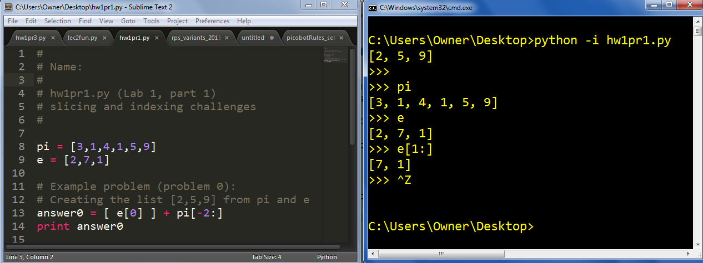

# Lab 3: Experimenting with Python

[20 points]

There are two parts to this lab:

- the first part is `hw3pr1.py`: you'll gain experience splicing and interacting with Python data

- the second part is `hw3pr2.py`: you'll write a number of functions, the fundamental building blocks of software

## Trying out the Python interpreter (or shell)

There's no file nor anything to hand in for this part -- just open Python's shell and try out the Python commands below...

You can tell if you're in the Python shell by the three-greater-than-sign prompt: >>> or, on its own line,

    >>>

Note that you don't have to type that prompt - it's already there!

## Arithmetic with numbers, lists, strings, booleans, ...

To get started, try a few arithmetic, string, and list expressions in the Python interpreter, e.g.,

    >>> 40 + 2
    42

    >>> 40 ** 2
    1600

    >>> 40 % 2
    0

    >>> 'hi there!'
    hi there!

(notice Python's politeness!)

    >>> 'who are you?'
    who are you?

(though sometimes it's a bit touchy.)

You can label data (here, a list) with a name (here, the name L) (no response
from Python).

    >>> L = [0,1,2,3]

You can see the data (here, a list) referred to by a name (here, L)
   
    >>> L
    [0,1,2,3]

You can slice lists (here, using the name L)

    >>> L[1:]
    [1,2,3]

You can reverse lists (or strings!) using "skip"-slicing with a -1 as the amount to skip.

    >>> L[::-1]
    [3,2,1,0]

You can slice lists using the raw list instead of the name
(Not that this would be very useful, admittedly!)

    >>> [0,1,2,3][1:]
    [1,2,3]

    >>> 100*L + [42]*100

(a list with 500 elements that I'm too lazy to type here - figure out how it works by experimenting)

You can reassign the name L to another value, even of a different type—now, L names the integer 42, instead of the list it used to represent.

    >>> L = 42

(no response from Python)

Two equals are different than 1! This tests for equality:

    >>> L == 42
    True

This tests for "not equal":

    >>> L != 42
    False

## Errors or Exceptions

Mistakes are unavoidable! So, you'll encounter Python errors. They're sometimes called exceptions, as well.

Perhaps the most important habit we hope you'll pick up is this: if an error happens, consider it an opportunity, not a problem! It's true, in that an error is a chance to (1) improve your intuition about how computation works, i.e., the "machine's mindset," (2) improve the software you're developing (or your understanding of it), and (3) build on your debugging skills... .

So, let's create some errors, which Python calls exceptions.

### Give yourself two minutes.

In that time, see how many of these Python exceptions you can cause! If you create others, all the better -- let an instructor or tutor know, and we'll add them to this list:

- `NameError` (an unrecognized variable!)
- `TypeError` (try slicing an integer for example!)
- `ZeroDivisionError` (perhaps clear from its name)
- `SyntaxError` (the error that kittens most often produce when walking over the keyboard)
- `IndexError` (try an out-of-bounds index into a sequence)
- `OverflowError` Remember that integers won't overflow -- if they get too big to fit in memory, they'll simply crash Python. Thus, to obtain this error you'll need to use a floating-point value, such as 42.0, in some mathematical expression that produces very large values!

## Lists! Challenges with slicing and indexing

This problem will exercise your slicing-and-indexing skills. First, use Sublime (or your favorite plain-text editor) to create a new text file. Just to be safe, you should save it -- right off the bat -- as `hw3pr1.py`.

*To do:* Then, copy the following starting lines into your new plain-text file:

    # 
    # Name:
    #
    # hw3pr1.py (Lab 2, part 1)
    # slicing and indexing challenges
    #

    pi = [3,1,4,1,5,9]
    e = [2,7,1]

    # Example problem (problem 0):
    # Creating the list [2,5,9] from pi and e
    answer0 = [ e[0] ] + pi[-2:]     
    print answer0

See below on how to run this code...

Please do include your name at the top of the file.

Again, save your file as a plain-text file named `hw3pr1.py`. Be sure to include the **.py** extension at the end.

After the initial comment, this code defines the list named `pi` and the list named `e`.

When you run the file, the line `answer0 = [ e[0] ] + pi[-2:]` will define the value held by the variable `answer0`.

Then, the code will print the value of the variable `answer0`.

### But how to run the code?   `python -i hw3pr1.py`

To run your file, make sure you are in the location (Desktop or other folder) where `hw3pr1.py` is located.

Then, you can run at the computer's command prompt:

    $ python -i hw3pr1.py

This will run the code and the `-i` will leave you at the Python prompt! Here is the result:

Here is a screenshot of Sublime Text + the terminal (on Windows):

From the above, you see that the example problem's code will run and print, and you'll see that `answer0` is the list `[2, 5, 9]`.

Also, the `-i` in the above command stands for interactive mode, which means Python enters an interactive session - with its **\>\>\>** prompt.

There, you have access to the variables `e` and `pi` -- and can work on the next challenges...

Remember that you can exit Python with control-z Enter (Windows) or control-d (Mac).

If you accidentally type command-d on the Mac, you'll split your terminal
in that case, type command-shift-d to "unsplit" it
Remember, too, you can simply up-arrow in order to run things again!

## The challenge: composing new lists from `pi`, `e`, and list operations

The problems below ask you to create several lists using only the list named `pi`, the list named `e`, and these list operations:

- list indexing such as `pi[0]`
- list slicing such as `e[1:]`
- skip-slicing such as `pi[6:4:-1]`
- list concatenation, `+`, such as `pi[:1] + e[1:]`     (do not use + to add values numerically)
- the list-making operator, `[ , ]`    for example:    `[ e[2], e[0] ]`

For each problem, place your answer into an appropriate variable in your `hw3pr1.py` file in the same style as the example answer (answer0), including comments. Use copy-and-paste to be as efficient as possible!

Please leave a blank line or two between your answers (to keep things readable - this makes the graders happy)!

Remember to use the python interpreter to check your answers often and to try things out... .

For fun only, you might try using as few operations as possible, to keep your answers elegant and efficient.

The problems:

0. Use `pi` and/or `e` to create the list `[2,5,9]`. This is the example above, stored in the variable answer0.

1. Use `pi` and/or `e` to create the list `[7,1]`. Store this list in the variable `answer1`. Again, this means that you should have these three lines in your file -- but with the answer included in the appropriate spot, after the answer1 =. Copy-and-paste from here, if you'd like:

        # Problem 1:
        # Creating the list [7,1] from pi and e
        answer1 =    
        print answer1

2. Use `pi` and/or `e` to create the list `[9,1,1]`. Store this list in the variable answer2.
3. Use `pi` and/or `e` to create the list `[1,4,1,5,9]`. Store this list in the variable answer3.
4. Use `pi` and/or `e` to create the list `[1,2,3,4,5]`. Store this list in the variable answer4.

## Testing your code!

For this week we have written some automated tests for `hw3pr1.py` , `hw3pr2.py` and `hw3pr3.py` .
This code will automatically check if your code file works for all the tests described in
the assignment. Of course it is still useful to still try the tests on your own as well, but
this will give you a nice a final check.

[Download the files here](week3_tests.zip)

Put the folder `check` in the same folder as your `hw3pr1.py` file. You can then run the tests
using:
    
    python check hw3pr1

and if all your first 5 answers are correct, you should get output like:

    :) correct output for answer0
    :) correct output for answer1
    :) correct output for answer2
    :) correct output for answer3
    :) correct output for answer4
    :( correct output for answer5
    :( correct output for answer6
    :( correct output for answer7
    :( correct output for answer8
    :( correct output for answer9
    :( correct output for answer10

## Practicing with strings

This problem continues in the style of the last one, but uses strings rather than lists. First, copy these strings into your `hw3pr1.py` file underneath the previous problems (with some blank lines to keep things apart!):

    # starting strings for Lab 1
    # we realize the not many HMCers are in CS5 this term - but,
    # as a result, these are probably equally (un)fair strings to use:

    h = 'harvey'
    m = 'mudd'
    c = 'college'

You may use any combination of these four string operations:

- String indexing, e.g., `h[0]`
- String slicing, e.g., `m[1:]`
- String concatenation, `+`, e.g., `h + m`
- Repetition, `*`,    e.g., `42*c` (using integers is OK here)

Again, less is more: the number of operations in the shortest answers that we know about are in parentheses. If you'd like, you might see if your answers are equally or more concise. However, any correct answer is OK - there's no requirement to use a small number of operations.

Example problem: Use `h`, `m`, and `c` to create `'heyyou'`. Store this string in the variable `answer42`. We used 9 operations.

Answer to example 5 - please copy and paste this into your file:

    # Problem 5:
    # Creating the string 'heyyou'
    answer5 = h[0] + h[4:] + h[-1] + c[1] + m[1]
    print answer5

The 9 operations are 4 uses of list indexing, 1 slice, and 4 concatenations with `+`. 

Here are the string-creation challenges (and, in parens, our most efficient answers, at least so far):

Remember that the "most efficient answers" are not at all needed (they may be fun, but any working answer is 100% OK!)

5. (The example from above)    Create heyyou and store this string in the variable answer5. (9 ops.)

6. Create collude and store this string in the variable answer6. (our best: 5 ops.)

7. Create arveyudd and store this string in the variable answer7. (our best: 3 ops.)

8. Create hardeharharhar and store this string in the variable answer8. (our best: 8 ops.)

9. Create legomyego and store this string in the variable answer9. (our best: 8 ops.)

10. Create clearcall and store this string in the variable answer10. (our best: 8 ops.)

If you have gotten to this point, you have completed the first half of Lab 1! 

**Make sure to run the tests again to see all your answers are correct**

