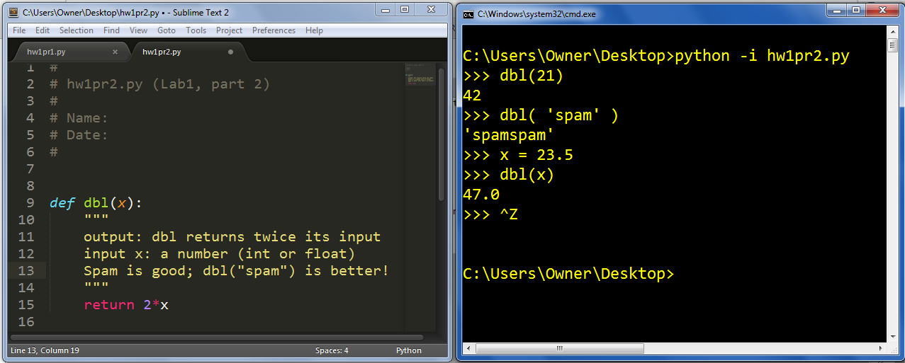
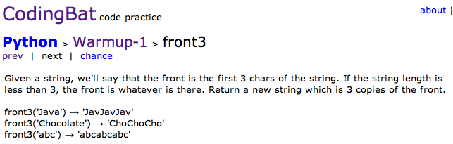

# Hw 3, Part 2 (Lab): Functioning smoothly!

[25 points]

## Using built-in functions

To begin, enter Python (just python at the computer's command prompt).

First, you'll try out some of Python's built-in functions. These will not go into your `hw3pr2.py` file:

    >>> range(0,100)
    [0,1,2,...,99]

`range` returns a list of integers

Note that when you use range, as with almost everything in python, the right endpoint is omitted!

    >>> sum(range(0,101))
    5050

`sum` sums a list of numbers, and range creates a list of integers. 

    >>> sum([40,2])
    42

a roundabout way of adding `40+2`

    >>> help(sum)
    (an explanation of sum)

help is a good thing—ask for it by name!

If you're on a Mac, hit q in order to leave the help interface... 

    >>> import math 

You do need to import `math` first... 

    >>> dir( math ) 

    >>> dir( __builtins__ ) 
    (a huge list of the math library's and the built-in functions, respectively)

This `dir` command is also useful - it lists everything from a particular library (or module, as it's called). The special `__builtins__` module holds all of the already-built-in functions! 

How to type `__builtins__`? There are two underscores both before and after the lowercase letters: the underscore, `_`, is shift-hyphen on most computer keyboards (between the right parenthesis and the plus sign). 

If you look carefully in the big list of stuff returned from `dir(_ _ builtins _ _)`, you will find the `sum` function you used above. You will not, however, find some other important functions, for example, `sin` or `cos` or `sqrt`. All of these functions (and many more) are in the `math` module. There are many, many more modules (libraries) of functions available for you to use as part of Canopy, along with even more available for download beyond that.

## Importing other code (or "modules")

To access functions that are not built-in by default, you need to load them from their modules. Try out these examples to get familiar with how to access Python's many libraries: 

(1)  You can import a module, i.e., a library, and then access its functions with that module name:

    >>> import math
    (no response from Python)

    >>> math.sqrt(9)
    3.0

Note that `sqrt` returns a `float` even if its input is an `int`.

    >>> math.cos(3.14159)
    -0.999...

Note that cos et al. take radians as input. Also, 3.14159 is less than `math.pi`.

### Create a new file named `hw3pr2.py`

Next, you'll create a few functions in a new file, `hw3pr2.py`.

So, use your Sublime Text (or other text-editor) to create a new file named `hw3pr2.py`.

Functions are the fundamental building blocks of computation. What distinguishes Python from other computing environments is the ease and power of creating your own functions.

To get started, copy and paste the following comments and a definition of a function named `dbl`:

    #
    # hw1pr2.py (Lab1, part 2)
    #
    # Name:
    # Date:
    #

    def dbl(x):
        """  output: dbl returns twice its input
             input x: a number (int or float)
             Spam is great, and dbl("spam") is better!
        """
        return 2*x

### Running your file!   `python -i hw3pr2.py`

As in problem 1, you'll want to run the file with `python -i hw3pr2.py`.

This will load your functions and then you can test them. For example, on Windows:

Here is the basic interaction: 

    >>> dbl(21)
    42 

The above code creates a function named dbl that outputs twice what it gets as input.

### Docstrings

The string inside triple quotes """ is called the docstring, short for "documentation string." We will ask you to include a docstring in all of your functions (even simple ones such as these, in order to feed the habit).

A docstring should describe what the function outputs and what the function inputs. As you see above, it may include other important information, too. In addition, the docstring becomes part of Python's built-in help system. This self-documenting feature in Python is especially important for making your functions understandable, both to others and to yourself! 

Warning: the first set of triple quotes of a docstring needs to be indented underneath the function definition def line, at the same level of indentation as the rest of block of code that defines the function.

### Using help to access docstrings

Python's built-in help command simply prints a function's docstring. As a result, when imported, your dbl function is already a fully-integrated part of the Python language and help system! Try typing help(dbl) at the interpreter prompt:

    >>> help(dbl)
    Help on function dbl in module __main__:

    dbl(x)
        output: dbl returns twice its input
        input x: a number (int or float)
        Spam is great, and dbl("spam") is better!

Remember that, on a Mac, typing the letter q will exit the help system. 

### Writing your own functions...

Let's go!

For each of these functions, be sure to include a docstring that describes what your function does and what its inputs are for each function. See the `tpl` example, below, for a reasonable starting point and guide:

Example problem: Write the function `tpl(x)`, which takes in a numeric input and outputs three times that input.

Answer to example problem: Copy the following solution (after a few blank lines to leave space and help readability) into your `hw3pr2.py` file:

    def tpl(x):
        """ output: tpl returns thrice its input
             input x: a number (int or float)
        """
        return 3*x

## Testing your own functions

You can test your own functions using the test code from part 1. Use the command:

    python check hw3pr2

Make sure the `check` folder and your `hw3pr2` are in the same folder. If your code
correctly contains the example above, you should see the following output:

    :) correct outputs for the function dbl()
    :( correct outputs for the function sq()
    :( correct outputs for the function interp()
    :( correct outputs for the function checkends()
    :( correct outputs for the function flipside()
    :( correct outputs for the function convertFromSeconds()
    :( correct outputs for the function front3()

## The functions to write...

**1.** Write `sq(x)`, which takes in a number named `x` as input. Then, `sq` should output the square of its input.

**2.** `interp(low,hi,fraction)` takes in three numbers, low, hi, and fraction, and should return the floating-point value that is fraction of the way between `low` and `hi`.

What!?

That is to say, if fraction is zero, low will be returned. If fraction is one, `hi` will be returned, and values of fraction between 0 and 1 will lead to results between `low` and `hi`. (In fact, values of fraction can go below 0, yielding outputs less than low, and they can go above 1, producing outputs greater than high. Purists would call this *extrapolation*, rather than interpolation, however.)

From the above description, it might be tempting to divide this function into several cases and use `if`, `elif`, and the like. Yet, this function can be written using no conditional (`if`/`elif`/`else`) constructions at all! Try it without using `if`!

As noted, your function should also work if fraction is less than zero or greater than one. In this case, it will be linearly extrapolating, rather than interpolating. We'll stick with the name `interp` anyway.

Here are examples that will help clarify how interp works:

    >>> interp(1.0, 9.0, 0.25)      # a quarter (.25) of the way from 1.0 to 9.0
    3.0

    >>> interp(1.0, 3.0, 0.25)      # a quarter of the way from 1.0 to 3.0
    1.5

    >>> interp(2, 12, 0.22)         # 22% of the way from 2 to 12
    4.2

Hint: If you're unsure of where to begin on this problem, look at the first example above. In it

    low is 1.0 
    hi is 9.0 
    fraction is 0.25 

See if you can determine how to combine those three values to yield the correct output of `3.0` . (Consider starting with (`hi - low`))

Here are two more examples to try:

    >>> interp(24, 42, 0)           # 0% of the way from 24 to 42
    24.0

    >>> interp(102, 117, -4.0)        # -400% of the way from 102 to 117 (whoa!)
    42.0

> The next several functions involve strings of characters. Write each one in your hw3pr2.py file. After you write each function, be sure to test it! Also, be sure to include a docstring for each function that tells (very briefly) what it does.

Write a function `checkends(s)`, which takes in a string `s` and returns `True` if the first character in `s` is the same as the last character in `s`. It returns `False` otherwise. The checkends function does *not* have to work on the empty string (the string `''`).
There is a hint below, but read through the examples first.

These examples will help explain `checkends` - read them over now and be sure to try them once you have a first draft of your function. Notice that the final, fourth example below is the string of one space character, which is different from the empty string, which contains no characters:

    >>> checkends('no match')
    False

    >>> checkends('hah! a match')
    True

    >>> checkends('q')
    True

    >>> checkends(' ')
    True

Make sure to check that this last example (the string of a single space) works for your checkends function. The empty string does not need to work.

Hint: For this function you could use an `if` and `else` construction... here is a start:

    if s[0] == ______ :
        return True
    else:
        return False

You might find a solution that doesn't use the `if` and `else` at all -- this is fine, too. Notice that the last character is missing above -- you'll need to fill that in! 

*Warning!*   Your function should not return strings! Rather, it should return a *boolean* value, either `True` or `False`, without any quotes around them. These `True` and `False` are keywords recognized by Python as representing one *bit* of information.

You'll see these booleans turn a different color, green in Canopy, indicating that Python does recognize them as bool values. (If you'd accidentally made them strings, they'd be quoted, and they'd be red in Canopy.) In sum, booleans and strings are different. For `True` and `False` you would almost always want the unquoted boolean values.

Write a function `flipside(s)`, which takes in a string `s` and returns a string whose first half is `s`'s second half and whose second half is `s`'s first half. If `len(s)` (the length of s) is odd, the first half of the input string should have one fewer character than the second half. (Accordingly, the second half of the output string will be one shorter than the first half in these cases.) There's also a hint after the examples below.
Here you may want to use the built-in function `len(s)`, which returns the length of the input string, `s`.

Examples:

    >>> flipside('homework')
    workhome

    >>> flipside('carpets')
    petscar

Hint: This function is simpler if you create a variable equal to `len(s)/2` on the first line, e.g.,

    def flipside(s):
        """ put your docstring here
        """
        x = len(s)/2
        return   _____________

where the `return` statement has been left up to you... it will use the variable `x` twice , which is why it's nice to give it a name, rather than type and re-type it!

These last functions combine string and arithmetic processing.

Write `convertFromSeconds(s)`, which takes in a nonnegative integer number of seconds `s` and returns a list (we'll call it `L`) of four nonnegative integers that represents that number of seconds in more conventional units of time, such that:

- the initial element represents a number of days
- the next element represents a number of hours
- the next element represents a number of minutes
- the final element represents a number of seconds

You should be sure that

- 0 ≤ seconds < 60
- 0 ≤ minutes < 60
- 0 ≤ hours < 24

There are no limits on the number of days. 
For instance,

    >>> convertFromSeconds(610)
    [0, 0, 10, 10]
    >>> convertFromSeconds(100000)
    [1, 3, 46, 40]

How to do this?    Feel free to copy-and-paste this starter code that uses four variables:

    def convertFromSeconds(s):
        days = s / (24*60*60)  # # of days
        s = s % (24*60*60)     # the leftover
        hours = 
        minutes = 
        seconds = 
        return [days, hours, minutes, seconds]

The idea here is that, when those four variables are all correctly set, you can return them all in a list, which is the final line:

    return [days, hours, minutes, seconds]

For instance, the line that sets days could be

    days = s / (24*60*60)

What would be other lines be?

It's possible to do this without changing the variable `s` at all. However, as the above starting code suggests, it's also possible to alter `s` as you go. Try this latter approach, just to get the hang of this powerful strategy.

The sixth (and final) function to write is [front3 from CodingBat](http://codingbat.com/prob/p147920), an excellent Python-practice website. Here is a scsreenshot: 

In your `hw3pr2.py` file, write this front3 function. (You might try that website, too, where you can get feedback on your function from within the browser... .)

If you'd like more practice - now or at any time - of the mechanics of Python, CodingBat is a great resource. It allows you to solve problems with short functions that are typed into and checked within your browser. In particular, with what we have covered thus far, these problems would be good -- but entirely optional! -- practice:

- [The not_string problem](http://codingbat.com/prob/p189441)
- [The sum_double problem](http://codingbat.com/prob/p141905)
- [The front_back problem](http://codingbat.com/prob/p153599)
- [The pos_neg problem](http://codingbat.com/prob/p162058)
- [The monkey_trouble problem](http://codingbat.com/prob/p120546)

or any of the CodingBat Python [warmup problems](http://codingbat.com/python/Warmup-1), which are only a small subset of all of its [Python problems](http://codingbat.com/python). 

You'll see that working on additional PythonBat problems makes up part of the extra-credit this week... Try it out :-)
