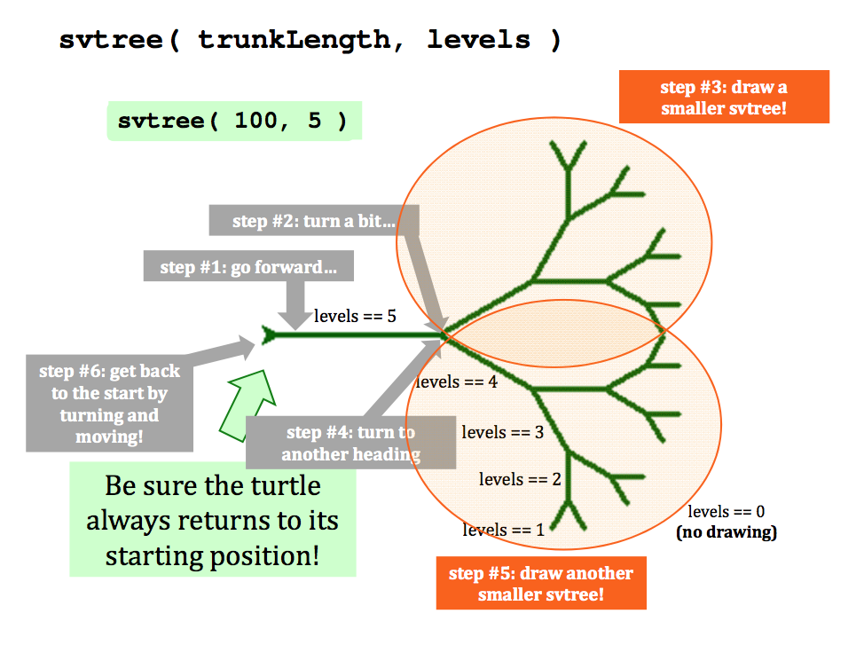
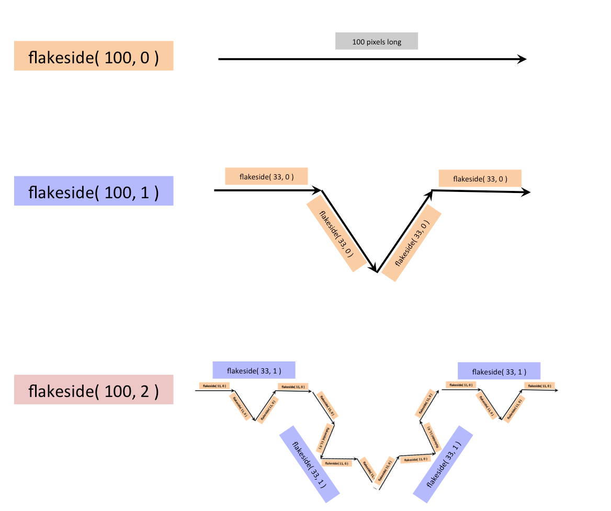

# Python Turtles...

[30 points]

## Setting up turtle...

Turtle graphics runs most smoothly using the terminal window. Feel free to run Python there, as usual!

If you're a different interface, here are a couple of notes:

_Canopy users you should disable Canopy's PyLab setting._ Here is how:

* [Windows] Under the Edit menu, choose Preferences
* [Mac] Under the Canopy menu, choose Preferences
* From your Preferences window, select the Python tab
* Click the PyLab check box to unselect it (unless it's already unselected)
* Restart the Python kernel: go to the Run menu and choose Restart kernel
* See if turtle graphics works! Remember that all turtle functions/commands need to end with done() to free the graphics window!! 

_IDLE users_

* this may or may not work... (you may have to switch to terminal or other interface)
* the graphics window may end up underneath...
* Remember that you may need to end with done() to free the graphics window!! 

_Last resort!_

* If your Python does not support turtle graphics, use this online turtle version! [turtle within skulpt's in-browser Python](http://www.skulpt.org/#)

## Trying out some turtle commands...

First, see how your version of Python interacts with turtle graphics

* whether it needs the use of `done()`
* whether it's part of your Python installation at all (some don't include it...) 

Start Python at the terminal with

* `python`

Then, try these commands at the \>\>\> prompt. You don't need the comments, but they shouldn't hurt if you paste them:

    from turtle import *    # loads the turtle library...
    width(5)        # make the turtle pen 5 pixels wide
    shape('turtle') # use a turtle shape!
    forward(100)    # turtle goes forward 100 steps
    right(90)       # turtle turns right 90 degrees
    up()            # turtle lifts its pen up off of the paper
    forward(100)    # turtle goes forward 100 steps
    down()          # turtle puts its pen down on the paper
    color("red")    # turtle uses red pen
    circle(100)     # turtle draws circle of radius 100 
    color("blue")   # turtle changes to blue pen
    forward(50)     # turtle moves forward 50 steps

See if you can close the turtle window... .

* If so, great!
* If not, or it's not behaving well, enter `done()` and then close it.
* If things go crazily wrong, you can always kill the Python terminal... 

If you'd like to check out all of the available turtle commands, the full turtle reference is available at this official turtle library page: [http://docs.python.org/library/turtle.html](http://docs.python.org/library/turtle.html)

## What colors are available?

Good question! The list of colors is pretty comprehensive: it's available on this [TkColorPageForPythonTurtle](https://www.cs.hmc.edu/twiki/bin/view/CS5Spring2015/TkColorPageForPythonTurtle).

In addition, you can create your own color with the following command:

    red = 1.0
    green = 0.0
    blue = 1.0
    color( red, green, blue )

where you can set `red`, `green`, and `blue` to any values from `0.0` to `1.0`.

The turtle will then draw with those rgb values until changed. The above example produces magenta... .

## A note on done()

For some computers, in order to release the turtle window (so that the OS can resize it, move it, etc.), you need to finish with the command

    done()

This announces that the drawing is finished and ready to be admired. You may lose your Python prompt until you close the graphics window.

This should **not** be in any functions you write! Instead, it's best to call your function and follow it by calling done(). For example, you can use a semicolon to separate two statements on the same line in Python. Here's how it would look:

    poly( 7, 7 ); done()

You'll try this next... .

# Starting `hw4pr1.py`: the _poly_ function...

Start a new Python source code file named `hw4pr1.py`. Feel free to paste this starter code, including a header comment (with your name), along with the import statement:

    #
    # hw4pr3.py
    #
    # name:
    
    from turtle import *
    import time
    
    def poly( n, N ):
        """ draws n sides of an N-sided regular polygon """
        if n == 0:
            return
        else:
            forward( 50 )   # 50 is hard-coded at the moment...
            left( 360.0/N )
            poly( n-1, N )

    # you _may_ need to end with done() when you call this
    # for example:   poly( 7, 7 ); done()

To run this septagonal example:

* load this file with `python -i hw4pr1.py` at the command-line 

Then, at the Python prompt, enter

    >>> poly( 7, 7 ); done()

The window may open up under other windows; you'll need to close the window after admiring it...

If your computer is slow to bring up the turtle window, you can create the window, pause a bit, then run the function and, if needed, finish with `done()`. You can separate all of these commands with semicolons. For example, as long as you have run `import time`, you can paste

    shape( 'turtle' ); time.sleep(2); spiral( 100, 90, 0.9 ); done()

You may not need any of this - if so, great!

## The spiral function [5 points]

The `poly` example is one of `single-path` recursion: the recursive calls are made a single time, so that there is a single, step-by-step path taken -- both by the code and by the turtle!

Next, try another single-path recursive function on your own...

To start, underneath the `poly` function, write another named `spiral`. Here is its signature:

    def spiral( initialLength, angle, multiplier ):

This `spiral` function should use the `turtle` drawing functions to create a spiral that

* has its first segment of length `initialLength` and
* whose neighboring segments form angles of `angle` degrees.
* The `multiplier` will be a float that will indicate how each segment changes in size from the previous one. For example, with a `multiplier` of `0.5` each side in the spiral should be half the length of the previous side. 

### Base cases!

The spiral should stop drawing when it has reached a side length of

* **less than 1 pixel** or
* **greater than 1000 pixels** 

Here's a picture from the call `spiral( 100, 90, 0.9 )`

Remember that you might need to type `done()` after calling spiral, e.g., `spiral( 100, 90, 0.9 ); done()` - in order to release the window! In addition, remember that if your computer is slow to bring up the turtle window, you can create a sequence of commands separated by semicolons, e.g., `shape( 'turtle' ); time.sleep(2); spiral( 100, 90, 0.9 ); done()`

Try altering your spiral function with different drawing attributes - for example

* different values of multiplier and angle
* include a different value of the line width in the code (or a changing value that depends on `initialLength`)
* a different, pre-programmed color within the function, or
* a random color for each segment of the spiral - by calling

    c = choice( ['green','red','blue'] )
    color( c )

## The chai function: branching recursion [5 points]

Next, you'll build a branching-recursion example. It's in branching that recursion is at its most _magical_ -- but it's also true that in composing these functions, it can be the most mind-bending. What's remarkable is that the _magic_ is, in the end, completely understandable... .

Start by pasting the chai function from class:

    def chai(size):
        """ our chai function! """
        if (size<9): 
            return
        else:
            forward(size)
            left(90)
            forward(size/2.0)
            right(90)
            right(90)
            forward(size)
            left(90)
            left(90)
            forward(size/2.0)
            right(90)
            backward(size)
            return

Then, try running it with `chai( 100 )` (maybe `chai( 100 ); done()` on your machine...)

Next, add one branch of recursion:

* between the two calls to `right(90)`,
* paste a recursive call to `chai( size/2 )`

Try it out!

Finally, add a second branch. It's really nothing more than a second branch, but because it's realized recursively, the resulting work (and visual intricacy) can be much greater!

* in addition to the above call,
* between the two calls to `left(90)`,
* paste a recursive call to `chai( size/2 )` 

Try it out! Try it with some different parameters, as well...

* For example, you could leave the first branching call at `chai( size/2 )` and change the second to `chai( size/3 )`
* or vice-versa...
* try adding a color change (or two) within the code...
* similarly, you might try adding a line-width change (or two) within the code... 

All of these example runs will build up intuition about how branching recursion works. In the end, it's simply creating a smaller version of the overall structure at **more than one location** within that structure.

**The key** to making "branching-recursion" work is making sure that your turtle **ends** at the same location that it **begins**. That is how you know that the statements after the recursive calls are moving the turtle as expected... .

## The svtree function (10 points)

Next, you'll write another branching example - here, "branching" seems like a particularly appropriate descriptor!

The idea here is to create a function that draws the side-view of a tree, hence `svtree`:

    def svtree( trunklength, levels )

Here is an example of the output from my function when `svtree( 128, 6 )` is run:

and another example of the output when `svtree( 50, 2 )` is run:

Note that these are **really** side view!

Calling `left(90); svtree(100,5)` will yield a more traditional tree pose! Also, here is a picture showing the self-similar breakdown of `svtree`. This is, in fact, an almost complete map of the `svtree` code!

### Hints

Consider the `chai` function above - and its recursive extension. It's is a good starting point for `svtree`.

The key to happiness with recursive drawing is this: **the pen must be back at the start (root) of the tree at the end of the function call!** That way, each portion of the recursion "takes care of itself" relative to the other parts of the image.

Don't worry about the exact angle of branching or the amount of reduction of the `trunklength` in sub-branches, etc.

* Design your own tree by making aesthetic choices for each of these. 

### Try more branches!

Once you have the `svtree` function working, alter it so that it has **three or more branches**, instead of only two...

* you can get some very dense _foliage_ very quickly
* even more _life-like_ results are possible if you use non-identical branching angles and size multipliers
* also, you could have the `width` or `color` depend on the value of `levels`
* if you make the final _level_ red, you can create an apple tree
* or, if you make that final _level_ a random color, you can produce fall-foliage-type effects... 

## The flakeside function [10 points]

The Koch Snowflake is an example of very deeply branching recursion. Here, however, the branching is **inward** rather than outward, as in `svtree`...

The Koch snowflake is a fractal with three identical sides -- it's the sides themselves that are defined recursively. Because of this, we provide the overall `snowflake` function for you to use -- here it is:

    def snowflake(sidelength, levels):
        """ fractal snowflake function
        sidelength: pixels in the largest-scale triangle side
        levels: the number of recursive levels in each side
        """
        flakeside( sidelength, levels )
        left(120)
        flakeside( sidelength, levels )
        left(120)
        flakeside( sidelength, levels )
        left(120)

Your task is to implement _flakeside(sidelength, levels)_ that will complete the definition of the Koch Snowflake. First Here is a graphical summary of its structure:

### Hints

A base-case Koch snowflake side is simply a straight line of length `sidelength`.

Each recursive level replaces the middle third of the snowflake's side with a "bump," i.e., two sides that would be part of a one-third-scale equilateral triangle.

See if you can determine the self-similar structure of the Koch snowflake! Some hints:

* if `levels` is zero, the base case, then `flakeside` should produce a single segment (base case!)
* Otherwise, notice that each `flakeside` at level `3` contains four `flakesides` of level `2`
* and each `flakeside` at level `2` contains four `flakesides` of level `1`... and so on
* Thus, `flakeside` will need to call itself **four** times! 

Remember that `flakeside` is only creating one of the three sides of the snowflake! Because of this, it does **not** have to end in precisely the same location as it begins... (If it did, all three sides would be on top of one another...)

Here are images of four different values of `levels` for a snowflake, `0`, `1`, `2`, and `3`:

More information on this Koch fractal curve is [here, among other places on the web](http://www.jimloy.com/fractals/koch.htm).

## Want more turtle?!?

Create your own recursive (and/or non-recursive) art! The extra-credit problem (hw4pr4.zip) invites you to try this...

In fact, if you've already - perhaps accidentally - created a work you like, take a screenshot...

Or build something new...

Either way, you can submit it there!

## Submitting hw4pr1.py

For the lab, you'll submit only the source code, `hw4pr1.py`

Happy turtling!

