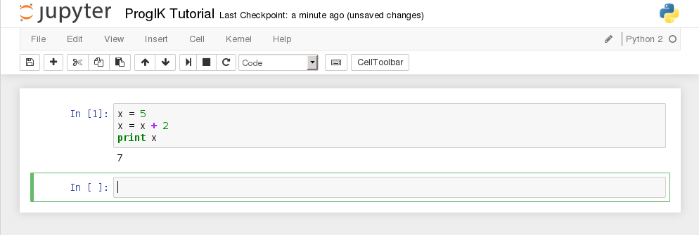
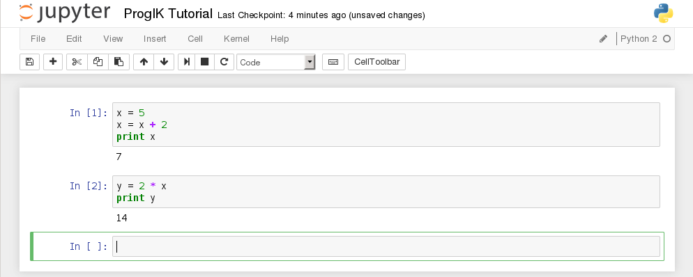
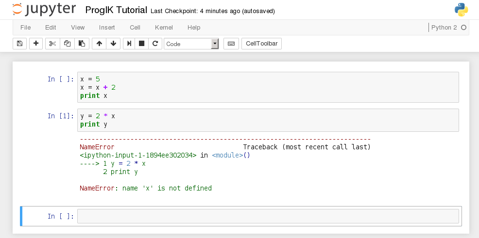
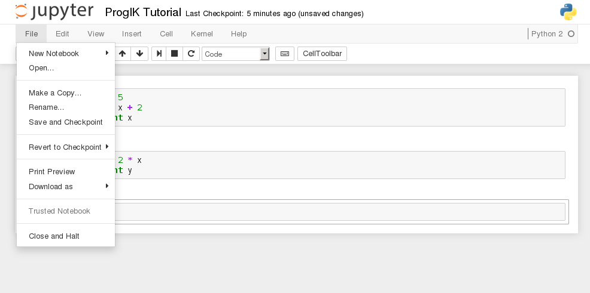
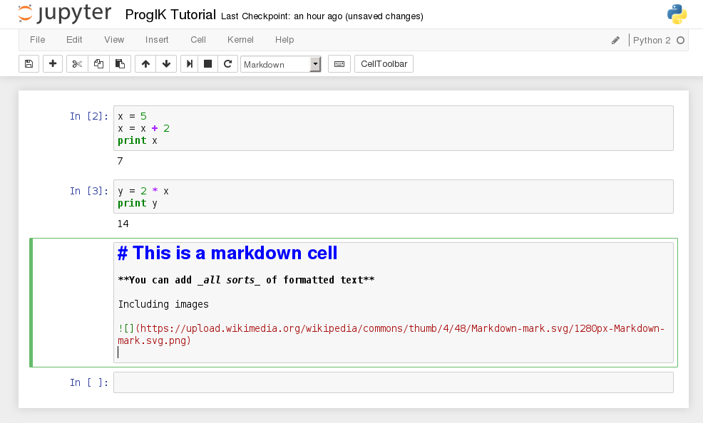
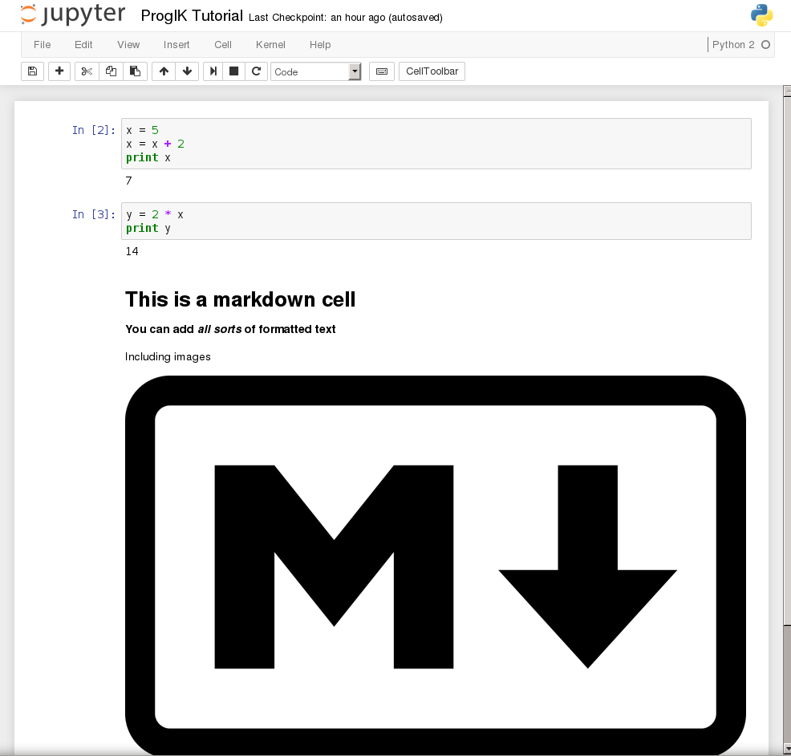
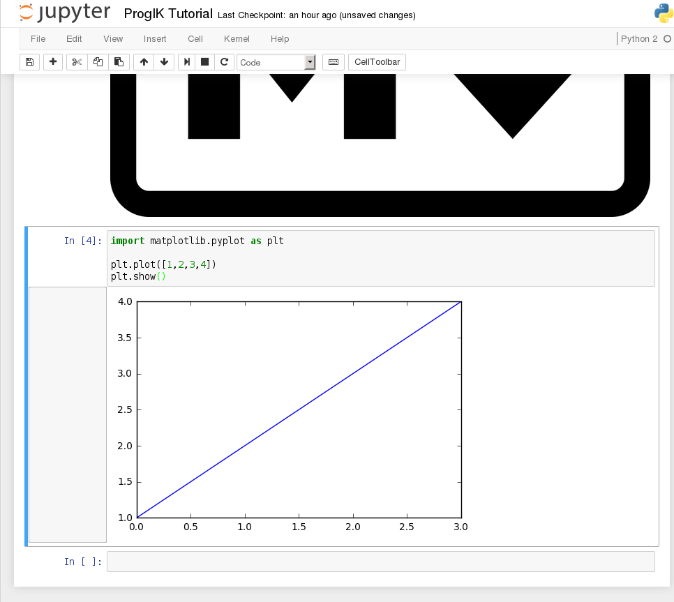

# Using Python to your advantage

This week we will try out some different useful tools for *Python*, to see how
we might use them to investigate a dataset or perhapse answer your own research
question. The tools we will try are:

* **Jupyter Notebook** (formerly known as IPython Notebook). This is tool that
lets you run *Python* in your browser, making it very easy to shown code you
wrote and the results it produces. It also allows you to add blocks of text and
images to explain your ideas.
* **Markdown**. This is a very simple language to format text. It lets you add
some special characters to the text to make it **bold** for instance.
(formatting on this webpage is actually also done in markdown) You can use it
to make the text you write about the code look a lot cleaner.
* **Matplotlib**. A library in *Python* used to make charts and graphs. This 
will let you turn all the numbers you crunch in *Python* into a nice visual
overview as a plotted line or bar-chart.

## Jupyter Notebook

You should already have installed *Notebook* during your introduction day at the
university. If not, follow
[this link](http://jupyter.readthedocs.io/en/latest/install.html).
*Make sure to install the version for Python 2.7, as that is what we have been
using these past few weeks!*

To start the *Notebook*, simply run this command your terminal:

    jupyter notebook

This will print some information about the *Notebook* server in your console, and
open a web browser to the URL of the web application. By defaut this is
[http://127.0.0.1:8888](http://127.0.0.1:8888). Note that 127.0.0.1 is the home
ip-adress, so this is now a webpage running on your own computer!

The first page shows the dashboard, which lists the notebooks currently
available in the notebook directory. By default this is the same folder where
you ran the command to start the *Notebook*. You can create new notebooks from
the dashboard with the `New` button (select *Python 2* notebook), or open
existing ones by clicking on their name. Creating a new notebook will create a
new file `Untitled1.ipynb` in your notebook directory. The extension `.ipynb`
indicates it is a notebook file, you can rename the file to something more
descriptive at the top of the page.

### Notebook cells

A notebook consists of a sequence of cells. A cell is a multi-line text input
field, and its contents can be executed by using `Shift-Enter`, or by clicking
the `Play` button the toolbar. What exactly this does depends on the type of
cell. There are four types of cells: *code cells*, *markdown cells*, *raw
cells* and *heading cells*. We will only focus on the first 2; code and
markdown. Every cell starts off being a code cell, but its type can be changed
by using a dropdown on the toolbar (which will be `Code`, initially).

In a code cell you can write *Python* code. When you run that cell (click on it
and pressing `Shift-Enter`) the code in the cell will run, and the output of
the cell will be displayed beneath the cell. For example, a simple first cell
might look something like this:

Global variables are shared between cells. This means we can still use
variables from the first cell in a second cell. Extending our simple example we
get:

By convention, notebooks are expected to be run from top to bottom. Failing to
execute some cells or executing cells out of order can result in errors. For
example, if we run the second cell before we run the first, we get an error
saying `x` is not defined

After you have modified a notebook for your assignment by modifying or
executing some of its cells, remember to save your changes using `Save and
Checkpoint`

### Try it out!

Create a new notebook `test.ipynb` and see if you can recreate all of the steps
above. Then try to add some of your own code and see if it produces the results
you would expect.

## Markdown

Markdown is a simple way to format text using some extra symbols like asterisks
(`*`) and underscores (`_`). The easiest way to learn is simply to try it.

For the next part of the lab, do this quick ten minute markdown tutorial:

[Markdown Tutorial](http://www.markdowntutorial.com)

If your answer is correct, you will see the next question. Make sure to do all
7 lessons. If you want a refence of all the symbols you can use in markdown,
the following page provides a nice list:

[Markdown CheatSheet](http://commonmark.org/help/)

### Adding markdown to your notebook

If you set a notebook cell as a markdown cell, you can write markdown directly
in the cell, like so

When you run this cell, the markdown will be formatted to the *rich text*

If you **double-click** the *rich text*, you can go back to editing the
markdown code.

Add some descriptions of your own code in seperate markdown cells to your
`test.ipynb` notebook.

## Matplotlib

Matplotlib is a plotting library for *Python*. One of its most used compontents
is the `matplotlib.pyplot` module. We will start off with a quick tutorial
again

[Pyplot Tutorial](http://matplotlib.org/users/pyplot_tutorial.html)

The most basic steps are

Importing the module

    import matplotlib.pyplot as plt

Here we rename the module to `plt` to make it a little less typing when we need
to actually use it.

Plotting a line

    plt.plot([1,2,3,4])

The `plot` function is the core function of the library. The above function call
plots the 4 y-values with implicit x-values of `range(4)`. Usually you would
use the function as `plt.plot(xvalues, yvalues, label="some_text")`. In this
case you must make sure that `xvalues` and `yvalues` are the same size (as the
first x-value will be plotted with the first y-value, and the second with the
second, etc.). The full documentation for the `plot` function can be found here:
[Plot Documentation](http://matplotlib.org/api/pyplot_api.html#matplotlib.pyplot.plot)

And finally, you should not forget to show your plot

    plt.show()

This tells matplotlib that you are done adding lines, labels and other stuff
to your figure.

### Adding a plot to your notebook

If you add a code cell to your notebook, you can use matplotlib there directly.

Try adding a cell to your `test.ipynb` file and plotting 2 lines. The x-values
should be
    
    1, 2, 3, 4, 5

The y-values of the first line are the x-values times 2. Label this line with
the text `linear`. You could make this y-value list in many ways in *Python*,
but try to use a list comprehension from week 5.

Add a second line with the same x-values, but make the y-values the squares
(`x ** 2`) of the x-values. Label this line `squares`.

If you have added all these cells to your notebook, you are done with the lab
for this week!

