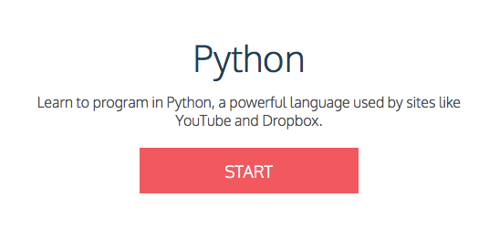

# Homework 1: Codecademy

Now that you've finished your Scratch game, and submitted it, let's try some programming in a language that is *not* graphical. We'll have to type in each concept by hand. For example, if you'd want to make a *branch* in a Python program, you will need to type the keyword `if`.

Codecademy is a free website where you can learn to program in various languages. For the remainder of the week, we'll ask you to finish the Python track. Just click the button below to jump to the course! Oh, and do not forget to register immediately! Else the website might forget your progress and you would have to start all over again!

We ask that you complete the course up to *and including* the lesson "Lists and Functions". You can stop when you reach the lesson "Battleship", but if your going pretty fast, feel free to carry on!
