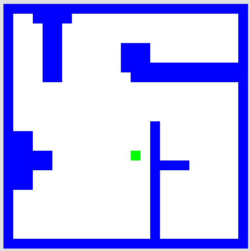

# Homework 2: Python

## These are due by Friday:

- Problem 1: Welcome to Python! (this is also Lab 2) [20 points] 
- Problem 2: Rock-Paper-Scissors [25 points] 
- Problem 3: Picobot (empty room) [25 points] 
- Problem 4: Picobot (maze) [25 points] 
- Problem 5: Extra-credit Picobot challenges: as optional extensions to Picobot, you might try
    - solving the empty room in as few rules as possible (6)   [worth +2 points]
    - solving the maze in as few rules as possible (8)   [worth +3 points]
    - Problem 5 is solving the "stalactite" map that looks like this one (with any # of rules)   [worth +5 points]
        
- Problem 6: Reading and response [5 points] 

