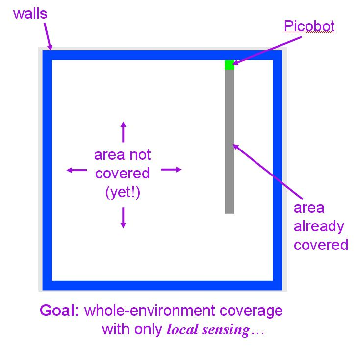
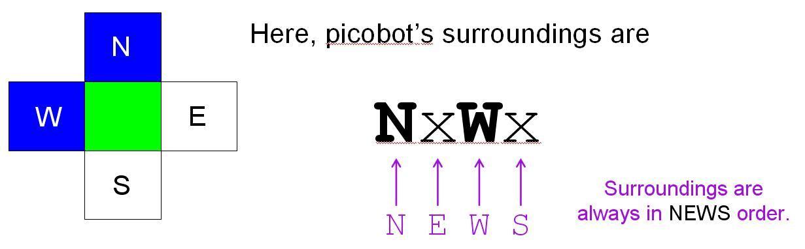
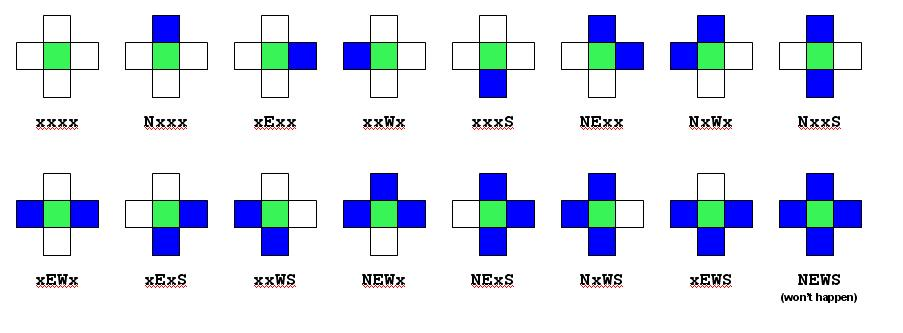

# Picobot, empty room

[25 points each]

## Introduction to Picobot

This problem explores a simple "robot," named "picobot," whose goal is to completely traverse its environment.

[Here is a link to the Picobot page.](http://www.cs.hmc.edu/picobot)

Picobot starts at a *random* location in a room—you don't have control over Picobot's initial location. The walls of the room are blue; picobot is green, and the empty area is white. Each time picobot takes a step, it leaves a grey trail behind it. When Picobot has completely explored its environment, it stops automatically. Picobot overview: 

## Surroundings

Not surprisingly, picobot has limited sensing power. It can only sense its surroundings immediately to the north, east, west, and south of it. For example,

Example picobot surroundings: 

In the above image, Picobot sees a wall to the north and west and it sees nothing to the east or south. This set of surroundings would be represented as follows:

    NxWx

The four squares surrounding picobot are always considered in NEWS order: an x represents empty space, the appropriate direction letter (N, E, W, and S) represents a wall blocking that direction. Here are all of the possible picobot surroundings:

All possible picobot surroundings: 

## State

Picobot's memory is also limited. In fact, it has only a single value from 0 to 99 available to it. This number is called picobot's state. In general, "state" refers to the relevant context in which computation takes place. Here, you might think of each "state" as one piece—or behavior—that the robot uses to achieve its overall goal.

Picobot always begins in state 0.

The state and the surroundings are all the information that picobot has available to make its decisions!

## Rules

Picobot moves according to a set of rules of the form 

    StateNow   Surroundings   ->   MoveDirection   NewState 

For example, 

      0   xxxS   ->   N   0   

is a rule that says "if picobot starts in state 0 and sees the surroundings xxxS, it should move `N`orth and stay in state `0`."

The `MoveDirection` can be `N`, `E`, `W`, `S`, or `X`, representing the direction to move or, in the case of `X`, the choice not to move at all.

If this were picobot's only rule and if picobot began (in state 0) at the bottom of an empty room, it would move up (north) one square and stay in state 0. However, picobot would not move any further, because its surroundings would have changed to xxxx, which does not match the rule above.

## Wildcards

The asterisk `*` can be used inside surroundings to mean "I don't care whether there is a wall or not in that position." For example, `xE**` means "there is no wall North, there is a wall to the East, and there may or may not be a wall to the West or South."

As an example, the rule 

      0   x***   ->   N   0   

is a rule that says "if picobot starts in state 0 and sees any surroundings without a wall to the North, it should move North and stay in state 0."

If this new version (with wildcard asterisks) were picobot's only rule and if picobot began (in state 0) at the bottom of an empty room, it would first see surroundings xxxS. These match the above rule, so picobot would move North and stay in state 0. Then, its surroundings would be xxxx. These also match the above rule, so picobot would again move North and stay in state 0. In fact, this process would continue until it hit the "top" of the room, when the surroundings Nxxx no longer match the above rule.

## Comments

Anything after the pound sign (#) on a line is a comment (as in python). Comments are human-readable explanations of what is going on, but ignored by picobot. Blank lines are ignored as well.

## An example

Consider the following set of rules:

    # state 0 goes N as far as possible
    0 x*** -> N 0   # if there's nothing to the N, go N
    0 N*** -> X 1   # if N is blocked, switch to state 1

    # state 1 goes S as far as possible
    1 ***x -> S 1   # if there's nothing to the S, go S
    1 ***S -> X 0   # otherwise, switch to state 0

Recall that picobot always starts in state 0. Picobot now consults the rules from top to bottom until it finds the first rule that applies. It uses that rule to make its move and enter its next state. It then starts all over again, looking at the rules and finding the first one from the top that applies.

In this case, picobot will follow the first rule up to the "top" of its environment, moving north and staying in state 0 the whole time. Eventually, it encounters a wall to its north. At this point, the topmost rule no longer applies. However, the next rule `0 N*** -> X 1` does apply now! So, picobot uses this rule which causes it to stay put (due to the "X") and switch to state 1. Now that it is in state 1, neither of the first two rules will apply. Picobot follows state 1's rules, which guide it back to the "bottom" of its environment. And so it continues...

## The assignment

For this assignment, your task is to design two different sets of picobot rules:

- hw 2, problem 3: one set that will allow picobot to completely cover an empty square room. 

    Remember to click on the "Enter rules for Picobot" before you try to run picobot.

- You need to copy your rules into a plain-text .txt file on your computer!
    - For the empty-room, be sure to name it **hw2pr3.txt**
    - For the maze, be sure to name it **hw2pr4.txt**

- Remember that your solutions must work from arbitrary starting positions within the environment.

## Optional extra credit

At heart, CS fundamentally tries to answer questions of complexity: to show that problems are easier than initially thought—or, sometimes, to prove that they can't be handled with fewer resources.

You might think about how efficient your solutions are—both in terms of the number of states used and in terms of the number of rules. There are other ways to measure efficiency as well (e.g., speed).

For optional extra credit, try to create as efficient a solution as possible for the maze-solving set of rules. That is,

- for problem 3 (the empty room), see if you can use only 6 rules [+2 points]
- for problem 4 (the maze), see if you can use only 8 rules [+4 points]
- You may also submit problem 5 (**hw2pr5.txt**), [+4 points]  with the Picobot rules for the "stalactite room" (with any number of rules): 
    

We don't (yet) know the minimum number of rules for that environment...!
