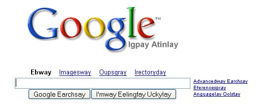

# Extra!

Who wouldn't want more recursion -- or, at least, Python!?

You should create a new Python file called `hw3pr4.py`, in which you include all of extra credit solutions.

There are three opportunities (up to 4 pts each):

- practice with strings on CodingBat with Python strings
- practice with lists on CodingBat with Python lists
- write a pig-latin-izing function (more with strings...)

### Extra #1: CodingBat for Python Strings and Lists

If you like the CodingBat practice-problem site, try some more! For +4 points, complete all of the Python [string problems](http://codingbat.com/python/String-1) on CodingBat's "String-1" Python string page. Use as many attempts as you'd like.

You'll receive +4 extra-credit points if you do complete all of those string problems successfully. Include your solutions in the hw3pr4.py file and add this comment:

      #
      # I finished all of the CodingBat STRING problems.
      #

### Extra #2: CodingBat for Python Lists

If you like the CodingBat practice-problem site, try some more! For +4 points, complete all of the Python [list problems](http://codingbat.com/python/List-1) on CodingBat's "List-1" Python list page. Use as many attempts as you'd like.

You'll receive +4 extra-credit points if you do complete all of those list problems successfully. Include your solutions in the hw3pr4.py file and add this comment:

      #
      # I finished all of the CodingBat LIST problems.
      #

### Extra #3: Pig Latin!

[up to another +4 points]

This problem asks you to write two functions that implement an English-to-Pig Latin translator.

Be sure to name and test your functions carefully. Include in each a docstring, which should indicate what the function computes (outputs) and what its inputs are or what they mean.

This problem is inspired by

### Warm up: 

Write `pigletLatin( s )`, which takes as input a string `s`. `s` will be a single word consisting of lowercase letters. Then, pigletLatin should output the translation of s to "piglet latin," which has these rules:

- If the input word has no letters at all (the empty string), your function should return the empty string

- If the input word begins with a vowel, the piglet latin output simply appends the string 'way' at the end. 'y' will be considered a consonant, and not a vowel, for this problem.

    Example:

        pigletLatin('one') returns 'oneway'

- If the input word begins with a consonant, the piglet latin output is identical to the input, except that the input's initial consonant is at the end of the word instead of the beginning and it's followed by the string 'ay'.

    Example:

        pigletLatin('be') returns 'ebay'

Of course, this is not full pig latin, because it does not handle words beginning with multiple consonants correctly. For example, `pigletLatin('string')` returns 'tringsay'.

You'll fix this next!

### The real pig latin challenge

Create a function called `pigLatin( s )` that handles the rules above and hadles more than one initial consonant correctly in the translation to Pig Latin. That is, `pigLatin` moves all of the initial consonants to the end of the word before adding 'ay'. (You may want to write and use a helper function to do this -- see the hint below.)

Also, `pigLatin` should handle an initial 'y' either as a consonant OR as a vowel, depending on whether the y is followed by a vowel or consonant, respectively. For example, 'yes' has an initial y acting as a consonant. The word 'yttrium', however, (element #39) has an initial y acting as a vowel. Here are some additional examples:

    >>> pigLatin('string')
    ingstray
    >>> pigLatin('yttrium')
    yttriumway
    >>> pigLatin('yoohoo')
    oohooyay

Tests? These we're leaving up to you!

### Hint!

One way to use recursion to assist in this is to write a function

    def initial_consonants( s ):

that returns a string of all of the initial consonants in the input string `s`. Thus, if s starts with a vowel, the empty string '' will be returned. 

If you think about this problem thoroughly, you'll find that not every possible case has been accounted for - you are free to decide the appropriate course of action for those "corner cases." We won't test these... .

Oodgay ucklay!
