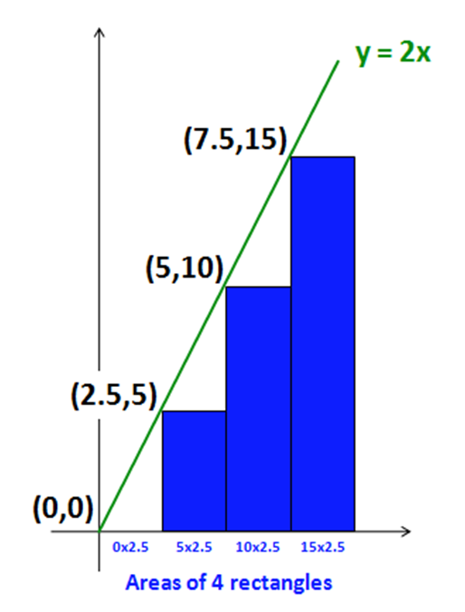

# Numeric Integration

[30 points]

## Starter code

For the first part of this homework you will build a Python program that can compute the areas underneath arbitrary mathematical functions... (mathematicians call these integrals...)

Doing this, you'll

* practice writing Python functions
* gain experience with _list comprehensions_
* write helper functions and compose large functions from smaller ones

### Getting started...

Start by creating a new file named `hw4pr2.py` and pasting into it this code:

    #
    # hw4pr2.py 
    # List comprehensions!
    #
    # Name:
    #
    

    # this gives us functions like sin and cos...
    from math import *    

    # two more functions (not in the math library above)
    
    def dbl(x):
        """ doubler!  input: x, a number """
        return 2*x

    def sq(x):
        """ squarer!  input: x, a number """
        return x**2
    

    # exampled for getting used to list comprehensions...
    
    def lc_dbl(N):
        """ this example takes in an int N
        and returns a list of integers
        from 0 to N-1, **each multiplied by 2**
        """
        return [dbl(x) for x in range(N) ]
    
    # Here is where your functions start for the lab:

    # Step 1, part 1
    def unitfracs(N):
        """ be sure to improve this docstring!
        """
        pass  # replace this line (pass is Python's empty statement)

### Trying out list comprehensions:

To begin, try out _list comprehensions_ at the Python prompt... they should help build intuition about how list comprehensions work:

    >>> lc_dbl(10)   # multiplication example
    [0, 2, 4, 6, 8, 10, 12, 14, 16, 18]

    >>> lc_dbl(5)    # a smaller example
    [0, 2, 4, 6, 8]

Read over the one-line functions; be sure you have internalized how they work!

## Integration: why? and what?

Integration is sometimes described as finding the area between a mathematical function and the horizontal (x) axis.

More generally, integration is simply the sum of a numeric function's output values, i.e., y-values across a chosen span.

It is important because it provides a one-number summary of what the function is _doing_ over an interval; it's used to determine how fields of forces act on a particular point/surface/object over time; it is also essential in defining a function's _average value_ on an interval or region.

As an example, recall the `dbl` function:

    def dbl(x):
        """ input: a number x (int or float)
        output: twice the input
        """
        return 2*x

Suppose you wanted to estimate the integral of `dbl`, on the interval between `0.0` and `10.0`. You could create the following (rough) approximation with rectangles:

1. Here, the interval is divided into 4 parts. The list `[0, 2.5, 5, 7.5]` represents the `x` value of the _left-hand endpoint_ of each of the four subintervals.
2. We next find the output values from `dbl(x)`  for each possible `x` in the list above. Here, name these output values `Y`: `Y = [0, 5, 10, 15]`.
3. Add up the areas of the rectangles whose upper-left-hand corner (height) is at these `Y` values. Each rectangle extends down to the x-axis. Each rectangle's individual width is `2.5`, because there are four equal-width rectangles spanning a total of `10` units of width.
4. We find the rectangles' areas in the usual way. Their heights are contained in the list `Y` and their widths are `2.5`, so the total area is  
`0*2.5 + 5*2.5 + 10*2.5 + 15*2.5`  
or  
`(0 + 5 + 10 + 15)*2.5`  
which is `(30)*2.5`, or `75`.

Yes, this is a very rough approximation for the _area under the curve_, i.e., the integral.

If we make the width of the rectangles smaller, however, their sum will approximate that area as closely as we'd like.

More importantly, this example suggests a general way to approximate a function's integral over a known interval:

1. Divide the interval into `N` equal parts and create a list with the corresponding `x` (input) values.
2. Find the `y` values (outputs) of the function for each value of `x` calculated in step 1
3. Calculate the area of each rectangle under the curve. Their heights are the `y` values; their widths are the separation between the `x` values.
4. Sum the rectangles' areas and return the result: that's the integral, or an approximation that can be made arbitrarily close. 

The rest of this homework involves writing functions for each of these four steps; then you'll use those functions to answer questions about the results.

## Step 1: Calculating the `x` values to be evaluated

First, you will write a function named `unitfracs(N)` and then one named `scaledfracs(low,hi,N)`.

### Writing `unitfracs` ...

Take a look at how `unitfracs(N)` works:

    >>> unitfracs(2)
    [0.0, 0.5]

    >>> unitfracs(4)
    [0.0, 0.25, 0.5, 0.75]

    >>> unitfracs(5)
    [0.0, 0.2, 0.4, 0.6, 0.8]

    >>> unitfracs(3)
    [0.0, 0.3333333333333333, 0.6666666666666666]

    >>> unitfracs(10)
    [0.0, 0.1, 0.2, 0.3, 0.4, 0.5, 0.6, 0.7, 0.8, 0.9]

**To do** Write `unitfracs(N)`.

As its name suggests, it returns a list of evenly-spaced left-hand endpoints (fractions) in the unit interval [0,1).

Be sure to fix the docstring of `unitfracs` to reflect what it does, as well.

### Writing `scaledfracs`...

Next, take a look at how `scaledfracs(low,hi,N)` works:

    >>> scaledfracs(10, 30, 5)
    [10.0, 14.0, 18.0, 22.0, 26.0]

    >>> scaledfracs(41, 43, 8)
    [41.0, 41.25, 41.5, 41.75, 42.0, 42.25, 42.5, 42.75]

    >>> scaledfracs(0, 10, 4)
    [0.0, 2.5, 5.0, 7.5]

**To do** Write `scaledfracs(low,hi,N)`. It creates `N` left endpoints uniformly through the interval [low,hi).

**Hint!** _This is tricky ... here is some additional explanation:_

Use `unitfracs`. For example, use this line as a starting point:

    return [                      for x in unitfracs(N) ]

This way, you won't have to redo the work of `unitfracs`!

You might feel that this is closely related to the interp function you wrote in Lab 3 -- you're right!

You don't need to use that interp function, but you will want to use the ideas from it! Here it is, for reference:

    def interp(low, hi, frac):
        """ returns a value frac of the way from low to hi """
        return low + (hi-low)*frac

Note that the role of `frac` above is as the _interpolating fraction_, which is exactly what `x` is doing in the list comprehension!

Do include a docstring that reflects what `scaledfracs` does.

## Step 2: Calculating the `y` values

Your `scaledfracs` function can produce arbitrary lists of evenly-spaced `x` values.

Next, you'll need to calculate the `y` values (outputs) of a function at each of these x positions. Again, you'll use list comprehensions to make this process simple and fast!

Although the goal is to handle arbitrary functions, we'll start with a concrete function and build up.

### Writing `sqfracs`...

**To do** Write a function sqfracs(low,hi,N) that works as follows:

    >>> sqfracs(4, 10, 6)
    [16.0, 25.0, 36.0, 49.0, 64.0, 81.0]

    >>> sqfracs(0, 10, 5)
    [0.0, 4.0, 16.0, 36.0, 64.0]

Here, `sqfracs` is very similar to `scaledfracs` _except that each value is squared_.

**Hint!** Use `scaledfracs` here. In the same way that `scaledfracs` used `unitfracs`, `sqfracs` can use `scaledfracs`! Consider the snippet:

    for x in scaledfracs(low, hi, N)

### Writing `f_of_fracs`...

**To do** Write a function `f_of_fracs(f, low, hi, N)` that works as follows:

    >>> f_of_fracs(dbl, 10, 20, 5)
    [20.0, 24.0, 28.0, 32.0, 36.0]

    >>> f_of_fracs(sq, 4, 10, 6)
    [16.0, 25.0, 36.0, 49.0, 64.0, 81.0]

    >>> f_of_fracs(sin, 0, pi, 4)   # the sine function
    [0.0, 0.71, 1.0, 0.71]
    
    # the above values are rounded versions of what 
    # will actually be displayed...

Note that `f_of_fracs` takes a _function_ as its first input -- this is no problem in Python.

you might copy-and-paste `sqfracs` as a _model_: only a few characters need to be changed! (3 of them, to be precise!)

## Step 3: Calculate the area + put it all together

You now have functions that calculate both the `x` and, more importantly, `y` values of a function at regularly-spaced intervals.

**To do** Next, you'll write `integrate(f,low,hi,N)` which will return the final, desired value: the integral of `f` from `low` to `hi` using `N` steps.

Take a look at a few examples and hints below.

As these examples highlight, `integrate` does not return a list; it returns a single, floating-point value:

    >>> import math             # to use math.pi and math.sin

    >>> integrate(dbl, 0, 10, 4)
    75.0                        # the example from the top of this lab

    >>> integrate(dbl, 0, 10, 1000)
    99.9                        # rounded from 99.8999... (precise value: 100)

    >>> integrate(sq, 0, 3, 1000000)  # a million steps will give Python pause
    8.9999865000044963          # close! (precise value: 9.0)

    >>> integrate(math.sin, 0, math.pi, 1000)
    1.9999983550656628          # pretty good! (precise value: 2.0)

Don't worry about small errors in the rightmost (least-significant) digits. They occur from small differences in Python versions.

To get started, here is the _signature_ (the `def` line) and docstring for `integrate`. Feel free to use this:

    def integrate(f, low, hi, N):
        """ integrate returns an estimate of the definite integral
        of the function f (the first input)
        with lower limit low (the second input)
        and upper limit hi (the third input)
        where N steps are taken (the fourth input)

        integrate simply returns the sum of the areas of rectangles
        under f, drawn at the left endpoints of N uniform steps
        from low to hi
        """

**Hints:**

* **do NOT use a list comprehension**: no list is being created here
* rather, use `f_of_fracs` to generate the list of heights you need
* remember that the output of `f_of_fracs` is a big list of `y`-values!
* You want to multiply those `y`-values (heights) by the rectangles' width. **But all the widths are the same!**
* So, you can sum the heights **then** multiply be the width!
* Use Python's built-in `sum`. `sum(L)` returns the sum of the elements in the list `L`.
* **Got 60 instead of 75?** then you wrote `((hi-low)/N)`, which divides two integers! (As a result it rounds down, as with all integer division). Perhaps the easiest way to remedy this is to multiply `low` in the expression above by `1.0`. This will make it - and everything it touches - into `float`s. 

Some examples on how `sum` works:

    >>> sum([10, 4, 1])
    15

    >>> sum(range(0, 101))
    5050

If your `integrate` function works, congratulations! You've built a general-purpose routine that can provide integrals for any computable function (including those for which there is no closed-form integral).

