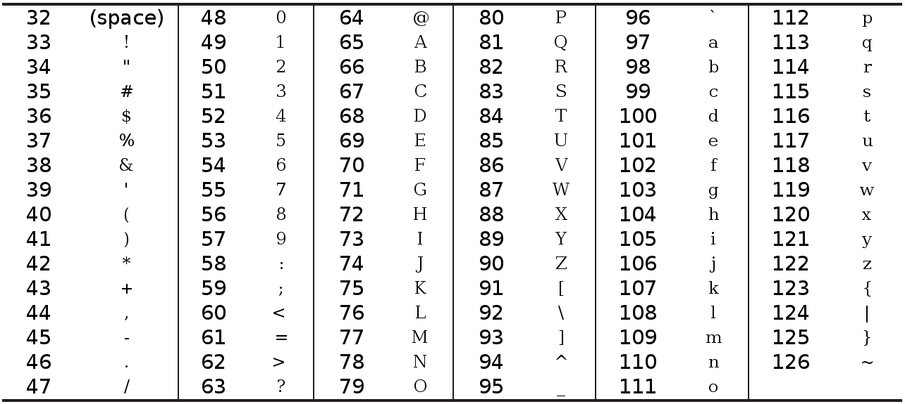

# Sorting out Caesar!

[60 points] `hw5pr2.py`

This problem asks you to write several functions using _functional programming_, i.e., conditionals, recursion, and/or list comprehensions.

For each one, be sure to

* name the function as specified - this helps us test them smoothly
* include a docstring that briefly explains the function's inputs and what it does 


### Caesar Cipher

The Caesar Cipher was one of the earliest ciphers ever invented. The method is named after Julius Caesar, who used it in his private correspondence. In this cipher, you encrypt a message by taking each letter in the message and replacing it with a _shifted_ letter. If you shift the letter `A` by one space, you get the letter `B`. If you shift the letter `A` by two spaces, you get the letter `C`. The image below is a picture of some letters shifted over by three spaces.

The amount by which the letters are shifted is also called the key, as you need it to _unlock_ the message. The key for the Caesar Cipher will be a number from 1 to 26, because there are only 26 possible shifts until you come back around to the same letter again. Unless you know the key (that is, know the number used to encrypt the message), you won’t be able to decrypt the secret code.


### ASCII, and Using Numbers for Letters

How do we implement this shifting of the letters as code? We can do this by representing each letter as a number called an ordinal, and then adding or subtracting from this number to form a new ordinal (and a new letter). ASCII (pronounced “ask-ee” and stands for American Standard Code for Information Interchange) is a code that connects each character to a number between 32 and 126.

The capital letters “A” through “Z” have the ASCII numbers 65 through 90. The lowercase letters “a” through “z” have the ASCII numbers 97 through 122. The numeric digits “0” through “9” have the ASCII numbers 48 through 57. Table 14-1 shows all the ASCII characters and ordinals.


Modern computers use UTF-8 instead of ASCII. But UTF-8 is backwards compatible with ASCII, so the UTF-8 ordinals for ASCII characters are the same as ASCII’s ordinals.




##Function to write #1: encipher(S, n)

Write the function `encipher(S , n)` that takes as input a string `S` and a non-negative integer `n` between 0 and 25. Then, `encipher` should return a new string in which the letters in `S` have been _rotated_ by `n` characters forward in the alphabet, wrapping around as needed.

For this problem, you should assume that upper-case letters are _rotated_ to
upper-case letters, lower-case letters are _rotated_ to lower-case letters, and
all non-alphabetic characters are left _unchanged_. For example, if we were to
shift the letter `'y'` by 3, we would get `'b'` and if we were to shift the
letter `'Y'` by 3 we would get `'B'`. In python, you can use the test the
following to determine if a character `c` is between `'a'` and `'z'` in the
alphabet:

    if 'a' <= c <= 'z':

You can write `encipher` any way you like as long as you use functional programming -- that is, feel free to use conditionals, recursion, and/or list comprehensions.

You might use the suggestion of writing a helper function that _rotates_ a single character by `n` spots, wrapping around the alphabet as appropriate. Then, you could use this helper function to encipher your string. It's up to you how you do this!

That said, for rotating, keep in mind that the built-in functions `ord` and `chr` convert from single-character strings to integers and back:

* For example, `ord('a')` outputs `97`
* and `chr(97)` outputs `'a'`. 

Remember that

* uppercase letters wrap around the alphabet to uppercase letters
* lowercase letters wrap always to lowercase letters
* non-letters do not wrap at all! 


###Hints, part 1... Write `rot(c, n)`!

* Write a function `rot(c, n)` that rotates `c`, a single character, forward by `n` spots in the alphabet.
* Remember that you'll need to wrap the alphabet and **leave non-alphabetic characters unchanged**
* Test out your rot(c, n) function to make sure it works:

    rot('a', 2)  -->  'c'  
    rot('y', 2)  -->  'a'  
    rot('A', 3)  -->  'D'  
    rot('Y', 3)  -->  'B'  
    rot(' ', 4)  -->  ' '    

###Hints, part 2  If you have `rot(c, n)`, you're nearly there!

* With `rot(c,n)`, this problem is identical to the `dna_to_rna(transcribe)` problem!
    * That is, you can handle one letter at a time using `rot(c, n)` in just the same way... .
* Alternatively, you can use a list comprehension to apply `rot(c, n)` to each letter.
    * If you do use a list comprehension, then use the built-in function `join`
    to join the resulting list back to a single string. It is a bit of a strange
    function in the way you use it; you start with the string you want to
    put between each string, called the *separator* and then `.join(`
    *the list you want to join* `)`. Given that we just want to join the
    elements, our separator is the *empty string* `''`. Here is an example
    of how to use the function:  
    ```
    >>> ''.join(['H', 'e', 'l', 'l', 'o'])
    ```
    <br/>
    ```
    'Hello'
    ```
    <br/>
    The full description of the `join` function can be found [here](https://docs.python.org/2/library/stdtypes.html#str.join).

Some encipher examples:

    >>> encipher('xyza', 1)
    'yzab'

    >>> encipher('Z A', 1)
    'A B'

    >>> encipher('*ab?', 1)
    '*bc?'

    >>> encipher('This is a string!', 1)
    'Uijt jt b tusjoh!'

    >>> encipher('Caesar cipher? I prefer Caesar salad.', 25)
    'Bzdrzq bhogdq? H oqdedq Bzdrzq rzkzc.'


##Function to write #2: `decipher(S)`

On the other hand, `decipher(S)` will be given a string of English text already shifted by some amount. Then, `decipher` should return, to the best of its ability, the _original_ English string, which will be some rotation (possibly `0`) of the input `S`. This means you will have to try each possible decoding and estimate how _English_ they are.

**Note:** some strings have more than one English _deciphering._ What's more, it is difficult or impossible to handle very short strings correctly. Thus, your `decipher` function _does not have to be perfect_. However, it should work almost all of the time on long stretches of English text, e.g., sentences of 8+ words. On a single word or short phrase, you will not lose any credit for not getting the correct deciphering!

Hints:

* A good place to start is to create a line with every possible ENCODING, something like this:
  
    L = [ ... for n in range(26)]
  
* Then, you can use the `LoL` _list of lists_ technique in which each element of `L` gets a score. It might look something like this:
  
    LoL = [[ ... for letter in encoding] for encoding in L]
  
* It's entirely up to you how you might want to score _Englishness._ See below for some starting points... .

One approach you could try is to use letter frequencies, meaning you compute how often each letter occurs in the text. This is a method often used in breaking classical ciphers. In any given stretch of written language, certain letters and combinations of letters occur with varying frequencies. Moreover, there is a characteristic distribution of letters that is roughly the same for almost all samples of that language. For instance, given a section of English language, E, T, A and O are the most common, while Z, Q and X are rare. 


You could, for example, use this information to count the number of times the top 5 most used letters (e,t,a,o,i) occur in each decryption, assuming that the correct english text should contain the most of these letters. You could also do something more complex, like using the frequency (or probability) of each letter to compute the probability the text is actual English. Or you could even compute a distribution of frequencies for each of your decryptions and see which one matches the best. A function providing those frequencies is provided below -- feel free to cut-and-paste it into your HW file. You're welcome to use some additional _heuristics_ (rules of thumb) of your own design. Also, you are welcome to write one or more small _helper_ functions that will assist in writing `decipher`.

However you approach it, **be sure** to describe whatever strategies you used in writing your `decipher` function in a short comment above your `decipher` function.

Some decipher examples:

    >>> decipher('Bzdrzq bhogdq? H oqdedq Bzdrzq rzkzc.')
    'Caesar cipher? I prefer Caesar salad.'  

    >>> decipher('Hu lkbjhapvu pz doha ylthpuz hmaly dl mvynla '\
    'lclyfaopun dl ohcl slhyulk.')
    'An education is what remains after we forget everything we have learned.'

    >>> decipher('Onyx balks')
    'Edon rqbai'  # mine is wrong! This is OK here...

Note that the last example shows that our decipherer gets some short phrases wrong -- **this is completely OK!**. Your decipherer should get more and more phrases correct, the longer they get, but it does not have to get single words or short phrases -- after all, for short strings, there are likely to be rotations that have more "English-y" letters than the original!

Here is a letter-probability function and its source:

    # table of probabilities for each letter...
    def letProb(c):
        """ if c is an alphabetic character,
        we return its monogram probability (for english),
        otherwise we return 1.0 We ignore capitalization.
        Adapted from
        http://www.math.cornell.edu/~mec/2003-2004/cryptography/subs/frequencies.html
        """
        if c == 'e' or c == 'E': return 0.1202
        if c == 't' or c == 'T': return 0.0910
        if c == 'a' or c == 'A': return 0.0812
        if c == 'o' or c == 'O': return 0.0768
        if c == 'i' or c == 'I': return 0.0731
        if c == 'n' or c == 'N': return 0.0695
        if c == 's' or c == 'S': return 0.0628
        if c == 'r' or c == 'R': return 0.0602
        if c == 'h' or c == 'H': return 0.0592
        if c == 'd' or c == 'D': return 0.0432
        if c == 'l' or c == 'L': return 0.0398
        if c == 'u' or c == 'U': return 0.0288
        if c == 'c' or c == 'C': return 0.0271
        if c == 'm' or c == 'M': return 0.0261
        if c == 'f' or c == 'F': return 0.0230
        if c == 'y' or c == 'Y': return 0.0211
        if c == 'w' or c == 'W': return 0.0209
        if c == 'g' or c == 'G': return 0.0203
        if c == 'p' or c == 'P': return 0.0182
        if c == 'b' or c == 'B': return 0.0149
        if c == 'v' or c == 'V': return 0.0111
        if c == 'k' or c == 'K': return 0.0069
        if c == 'x' or c == 'X': return 0.0017
        if c == 'q' or c == 'Q': return 0.0011
        if c == 'j' or c == 'J': return 0.0010
        if c == 'z' or c == 'Z': return 0.0007
        return 1.0


## Function to write #3: `blsort(L)`: Binary-list sorting...

Design and write a function named `blsort(L)`, which will take in a list `L` and should output a list with the same elements as `L`, but in ascending order. However, `blsort` **ONLY NEEDS TO HANDLE LISTS OF BINARY DIGITS**, that is, this function can and should assume that `L` will always be a list containing only `0`s and `1`s.

You may not call Python's `sort` to solve this problem! Also, you should not use your own sort (asked in a question below), but you may use any other technique to implement `blsort`. In particular, you might want to think about how to take advantage of the constraint that the input will be a binary list -- this is a considerable restriction!

One helper function that some have found useful to make is `count(e,L)`, to count how often an element `e` occurs in a list `L`.

Here are some examples:

    >>> blsort([1, 0, 1])
    [0, 1, 1]

    >>> L = [1, 0, 1, 0, 1, 0, 1]
    >>> blsort(L)
    [0, 0, 0, 1, 1, 1, 1]

**Hint:** in the end, this problem is much _easier_ than ordinary sorting!

##Function to write #4: `gensort(L)`:  General-purpose sorting

Use recursion to write a general-purpose sorting function `gensort(L)` which takes in a list `L` and should output a list with the same elements as `L`, but in ascending order. Feel free to use the [max](https://docs.python.org/2/library/functions.html#max) function built-in to Python (or [min](https://docs.python.org/2/library/functions.html#min) if you prefer) and the list [remove](https://docs.python.org/2/tutorial/datastructures.html) function. Recursion -- that is, sorting the _rest_ of the list -- will help, too.

Here are some examples:

    >>> gensort([42, 1, 3.14])
    [1, 3.14, 42]

    >>> L = [7, 9, 4, 3, 0, 5, 2, 6, 1, 8]
    >>> gensort(L)
    [0, 1, 2, 3, 4, 5, 6, 7, 8, 9]

For this problem, you should **not** use any of Python's built-in implementations of sorting for this problem -- for example, `sorted(L)` or `L.sort()`. Rather, you're designing and implementing your own approach from scratch!

Note that `gensort(L)` should work for _lists_ `L`. It does **not** have to work for string inputs.

##Function to write #5: `jscore(S, T)`:  Jotto scoring

Write a function named `jscore(S, T)`, which will take in two strings, `S` and `T`. Then, `jscore` outputs the _jotto score_ of `S` compared with `T`.

This jotto score is the number of characters in `S` that are shared by `T`. Repeated letters are counted multiple times, as long as they appear multiple times in both strings. The examples below will make this clear. Note that, in contrast to the traditional game of 5-letter jotto, we are not constraining the lengths of the input strings here!

There are several ways to accomplish this, many of which use small helper-functions - feel free to add any such helper functions you might like.

Note that if either `S` or `T` is the empty string, the jotto score should be zero!

**Hint** This line turns out to be a useful test:

    if S[0] in T:

Some examples:

    >>> jscore('diner', 'syrup')  # just the 'r'
    1

    >>> jscore('geese', 'elate')  # two 'e's are shared
    2

    # 2 'a's, 1 't', 1 'c', 1 'g'
    >>> jscore('gattaca', 'aggtccaggcgc')
    5

    >>> jscore('gattaca', '') # if empty, return 0
    0

##Function to write #6: `exact_change(target_amount, L)`

**Making change!**  Use recursion to write a Python function `exact_change` with the following signature:

    def exact_change(target_amount, L):

where the input `target_amount` is a single non-negative integer value and the input `L` is a list of positive integer values. Then, `exact_change` should return either `True` or `False`: it should return `True` if it's possible to create `target_amount` by adding up some-or-all of the values in `L`. It should return `False` if it's **not** possible to create `target_amount` by adding up some-or-all of the values in `L`.

For example, `L` could represent the coins you have in your pocket and `target_amount` could represent the price of an item -- in this case, `exact_change` would tell you whether or not you can pay for the item exactly.

Here are a few examples of `exact_change` in action. Notice that you can _always_ make change for the target value of `0`, and you can _never_ make change for a negative target value: these are two, but not all, of the base cases!

    >>> exact_change(42, [25, 1, 25, 10, 5, 1])
    True
    
    >>> exact_change(42, [25, 1, 25, 10, 5])
    False

    >>> exact_change(42, [23, 1, 23, 100])
    False

    >>> exact_change(42, [23, 17, 2, 100])
    True

    # needs to be able to "skip" the 16...
    >>> exact_change(42, [25, 16, 2, 15])
    True

    >>> exact_change(0, [4, 5, 6])
    True
    
    >>> exact_change(-47, [4, 5, 6])
    False

    >>> exact_change(0, [])
    True

    >>> exact_change(42, [])
    False

**Hint:** This problem can be handled by recursing twice and giving a name to each of the two results.

* For the first, try solving the problem _without_ the first coin. (This is the _loseit_ case!)
  * You might even use the variable name `loseit`, as in `loseit = exact_change( ... ) `
* For the second, try solving it _with_ the first coin. (This is the _useit_ case!)
  * You might continue by using the variable name `useit`, as in `useit = exact_change( ... )` 
* Then, have your code figure out what the appropriate boolean value to return, depending on the results it gets!
  * **Hint on this last part of the hint**: This problem puts the `or` into _useit or loseit_ - literally! 

#Extra!

Are you saying to yourself, _Never enough algorithms!_ ?

Here is an optional extra-credit algorithm-design challenge that builds from `exact_change`. It's more difficult because

* it returns the actual coins for making change, and
* it can also return `False`, so there are several cases to handle after the recursion... 


## Optional extra challenge: `make_change(target_amount, L)`

If you'd like a real challenge when you're done, try writing a second
change-handling function named `make_change(target_amount, L)`.

This function should actually determine which values (from `L`) could be returned to total the `target_amount`.

That is, instead of simply returning `True` or `False`, your `make_change` function should return **a list** of coins taken from `L` that sum up to `target_amount`. If there is no such list, then `make_change` should simply return `False`. If there are more than one possible lists of values from `L`, then your function may return any one of the valid answers.

The _order_ of the values returned does not matter, though it's natural to have them in the same order as they appear in the original list (our tests will do this...).

You do not have to, but you are welcome to use `exact_change` as a subroutine here!

The examples below show how `make_change` should work; these are the same inputs as in the `exact_change` function above.

In addition, `sorted` has been called, at least on the non-empty feasible cases, so that the results have a well-defined order:

    >>> sorted(make_change(42, [25, 1, 25, 10, 5, 1]))
    [1, 1, 5, 10, 25]
    >>> make_change(42, [25, 1, 25, 10, 5])
    False
    >>> make_change(42, [23, 1, 23, 100])
    False
    >>> sorted(make_change(42, [23, 17, 2, 100]))
    [2, 17, 23]
    >>> sorted(make_change(42, [25, 16, 2, 15]))
    [2, 15, 25]
    >>> make_change(0, [4, 5, 6])
    []
    >>> make_change(-47, [4, 5, 6])
    False
    >>> make_change(0, [])
    []
    >>> make_change(42, [])
    False

